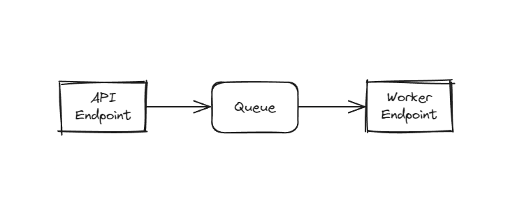
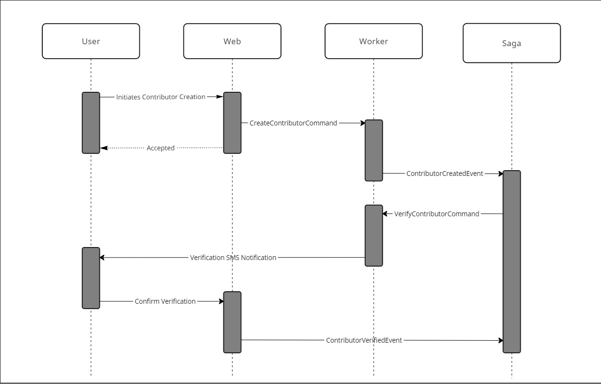
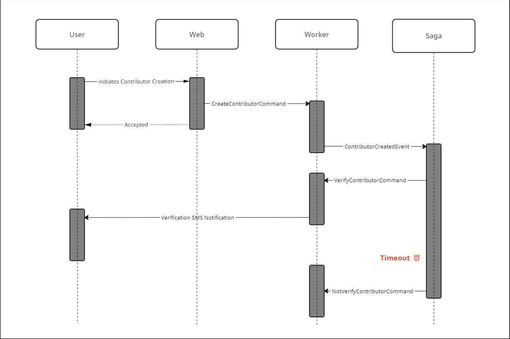

# NServiceBusTutorial

Sample code for the [NimblePros](https://nimblepros.com/) series on NServiceBus with .NET 8

## Background Information

This project serves to explain in code the concepts of NServiceBus. The project is broken down into multiple parts, each part focusing on a different aspect of NServiceBus. This code is meant to be a companion to the blog series on NServiceBus by NimblePros. I will try to tag the codebase when each article is published so that you can follow along with the blog series but for the most part, the code should be backward compatible as the series progresses. Any configuration or manual build steps will be documented in this README file to make it easier to follow along.

## Projects 

### NServiceBusTutorial.Web

A Web API project that sends messages to the NServiceBusTutorial.Worker endpoint.

### NServiceBusTutorial.Worker

A Worker Service project that receives messages from the NServiceBusTutorial.Web endpoint.

### NServiceBusTutorial.Saga 

Coming soon!

## Diagrams

### Simple Diagram (pre-saga)

### Sequence Diagrams For Contributor Verification

#### Verified Flow

#### Not Verified Flow

## Dependencies

### Transports

Currently, this project uses `LearningTransport` which automatically configures a file-based queue at the root of the repository when the applications start. This is useful for development and testing but should not be used in production.

## Resources

NimblePros blog posts on NServiceBus

1: [What is NServiceBus?](https://blog.nimblepros.com/blogs/what-is-nservicebus/)

2: [Getting Started with NServiceBus?](https://blog.nimblepros.com/blogs/getting-started-with-nservicebus/)

3: [Commands, Events, and Messages Explained](https://blog.nimblepros.com/blogs/commands-events-messages-explained)

4: [Testing NServiceBus Message Handlers](https://blog.nimblepros.com/blogs/testing-nservicebus-message-handlers/)
